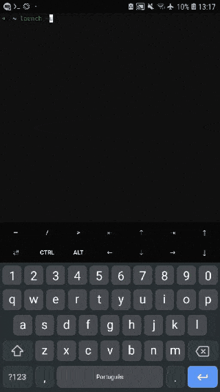

# Termux:Launch
Launch apps on Termux

<details markdown='1'>
    <summary>Demo</summary>
    
</details>


### Install

##### Dependences
    pkg install git

1. Install Termux Launch on [realease](https://github.com/GlitchYou/termux-launch/releases/tag/1.2)
2. Open the app and it will show a notification
3. Click install to proceed with the installation


### Uninstall

```bash
rm -f $(command -v launch)
sed -i 's|.*launch-completion.bash||' ~/.bashrc # Replace ~/.bashrc with your shell's config file
```


### How to use

    $ launch --help
    Usage:
      launch [ -a --app <app_name> ] [ -i --info <app_name> ] [ -u -update ] [ -h --help ]
        Launch apps on android
      
      -a --app       -- open app
      -i --info      -- show app settings
      -u --update    -- load all apps
      -h --help      -- show help
 
    $ launch -a play_store
    Starting play_store...
    ...

    $ launch -i tasker
    Starting info tasker...
    ...

    $ launch -u
    Loading Apps...
    ...


##### Import this project

> I did this project with the help of [Tasker](https://play.google.com/store/apps/details?id=net.dinglisch.android.taskerm)

To add new functions or see how this project works import it by clicking [here](https://taskernet.com/shares/?user=AS35m8lZFkvcWqyrgtPNlB2Mh52ouETCHLjBo4o18oCQ0xa81fNP%2Fw5ZsXNm7UpARlC3g9C%2BsFR3pw%3D%3D&id=Project%3ATermux%3ALaunch)
